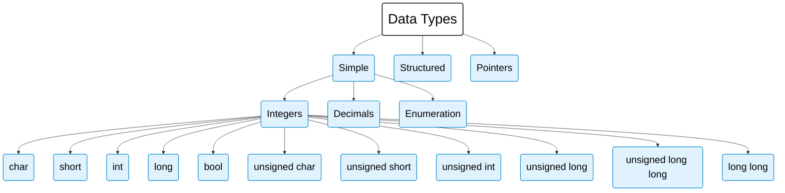
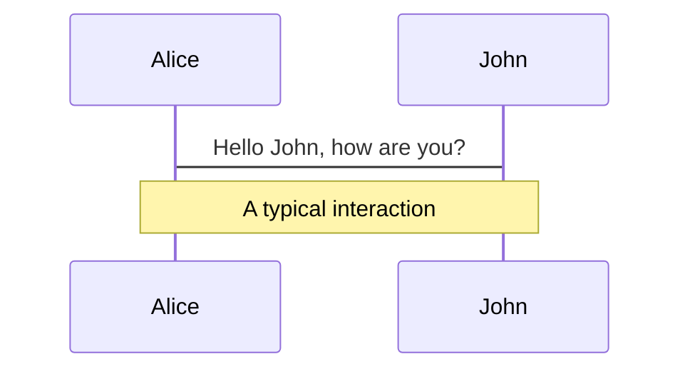
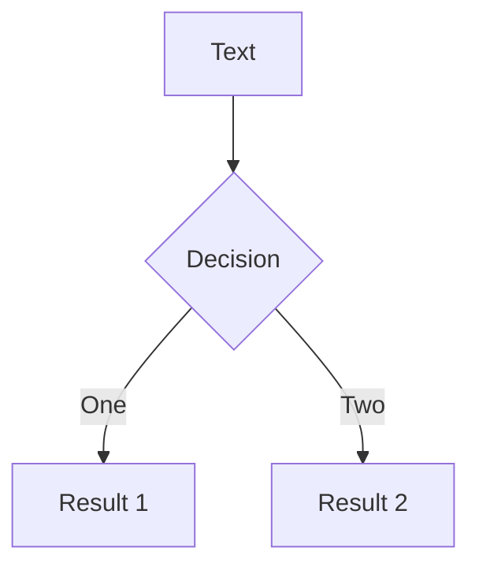
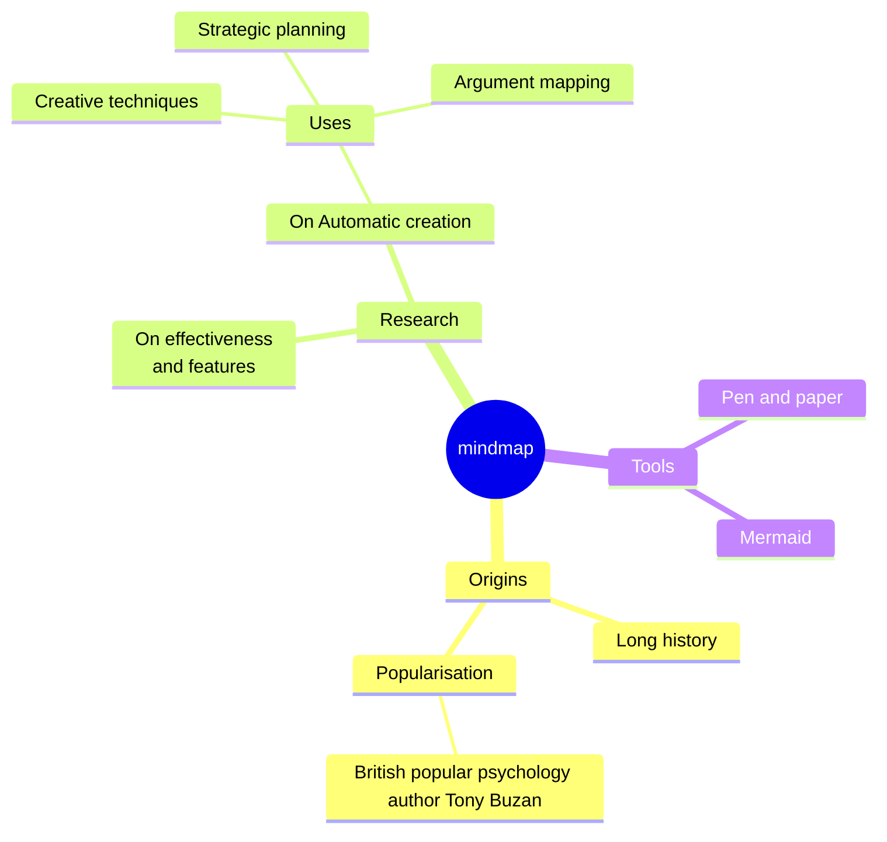
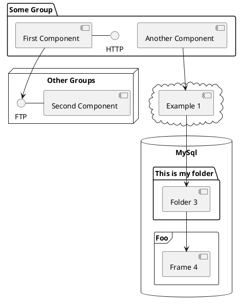

---
# You can also start simply with 'default'
theme: Dracula
# random image from a curated Unsplash collection by Anthony
# like them? see https://unsplash.com/collections/94734566/slidev
background: https://cover.sli.dev
# some information about your slides (markdown enabled)
title: Welcome to Slidev
info: |
  ## Slidev Starter Template
  Presentation slides for developers.

  Learn more at [Sli.dev](https://sli.dev)
# apply unocss classes to the current slide
class: text-center
# https://sli.dev/features/drawing
drawings:
  persist: false
# slide transition: https://sli.dev/guide/animations.html#slide-transitions
transition: fade-out
# enable MDC Syntax: https://sli.dev/features/mdc
mdc: true
# open graph
seoMeta:
  # By default, Slidev will use ./og-image.png if it exists,
  # or generate one from the first slide if not found.
  ogImage: auto
  # ogImage: https://cover.sli.dev
---

# Basic elements of C++

Dr. Danish Khan (dkhan@sdccd.edu)

<div @click="$slidev.nav.next" class="mt-12 py-1" hover:bg="white op-10">
  Press Space for next page <carbon:arrow-right />
</div>

<div class="abs-br m-6 text-xl">
  <button @click="$slidev.nav.openInEditor()" title="Open in Editor" class="slidev-icon-btn">
    <carbon:edit />
  </button>
  <a href="https://github.com/slidevjs/slidev" target="_blank" class="slidev-icon-btn">
    <carbon:logo-github />
  </a>
</div>
<!--
The last comment block of each slide will be treated as slide notes. It will be visible and editable in Presenter Mode along with the slide. [Read more in the docs](https://sli.dev/guide/syntax.html#notes)
-->

---


# Navigation

Hover on the bottom-left corner to see the navigation's controls panel, [learn more](https://sli.dev/guide/ui#navigation-bar)

## Keyboard Shortcuts

|                                                     |                             |
| --------------------------------------------------- | --------------------------- |
| <kbd>right</kbd> / <kbd>space</kbd>                 | next animation or slide     |
| <kbd>left</kbd>  / <kbd>shift</kbd><kbd>space</kbd> | previous animation or slide |
| <kbd>up</kbd>                                       | previous slide              |
| <kbd>down</kbd>                                     | next slide                  |

<!-- https://sli.dev/guide/animations.html#click-animation -->


---

# Outline

Following outline will be covered in this presentation

- Basic components of a C++ program
- Data types
- Arithmetic operators
- Familiar with string data type
- Assignment statements
- Variable declarations<br>
  <br>

Read more about [Why Slidev?](https://sli.dev/guide/why)

<!--
You can have `style` tag in markdown to override the style for the current page.
Learn more: https://sli.dev/features/slide-scope-style
-->

<style>
h1 {
  background-color: #2B90B6;
  background-image: linear-gradient(45deg, #4EC5D4 10%, #146b8c 20%);
  background-size: 100%;
  -webkit-background-clip: text;
  -moz-background-clip: text;
  -webkit-text-fill-color: transparent;
  -moz-text-fill-color: transparent;
}
</style>
<!--
Here is another comment.
-->


---
layout: image-left
image: https://cover.sli.dev
---

# Code

---
layout: center
---
# What is a Computer Program?

 A **computer program** is a **set of instructions written in a programming language** that tells a computer how to perform specific tasks or solve particular problems. These instructions are executed by the computer’s processor in a precise order, allowing it to process data, make decisions, and produce desired outputs.


---
---

# A typical C++ program


<div class="flex justify-end space-x-98">
<span class="px-2 py-1 text-xs font-bold text-white bg-blue-600 rounded">
  Calculating slope-intercept form of a straight line. (Code page 1/2)
</span>
<span class="px-2 py-1 text-xs font-bold text-black bg-gray-300 rounded">
  Copy this code
</span>
</div>


````md magic-move {lines: true}
```cpp {*|1-4|6-8|10|11|12-13|14-16|18-20}


#include <iostream> 
	/* ⬆ Reads as Input/Output Stream. It’s part of the C++ Standard 		
	Library and allows your program to read input (from the keyboard) and write output 
	(to the console, files, etc.).*/

using namespace std;
	/* ⬆ Use standard library. You’re telling the compiler:
	“Don’t make me type std:: every time I use something from the standard library.” */

int main()		// Execution begins from the main. This is a function which return 0.
{				// start of the main function
	double y = 0.0;		
	/* ⬆ Allocate a memory location named y to store a decimal value, and initialize it to 0. */
	double x = 0; 	//The same concept applies here, but with a different memory location name.
	double constant = 0;
	double slope = 0;
	
	y = constant + (slope * x);
	/* ⬆ The calculation is performed from right to left, and the result is stored in the memory location y 
	as a decimal value. */
	

```
````
---

<span class="px-2 py-1 text-xs font-bold text-white bg-blue-600 rounded">
  ...contd. (Code page 2/2)
</span>

````md magic-move {lines: true}
```cpp{1-3|5-7|9|}
	cout << "The value of y is "<< y << endl;
	/* ⬆ cout (character output) is used to display text on the console. The << insertion operator 
	sends data into the output stream, which in this case is the screen.*/
	
	return 0;
	/* ⬆ In C++, the function main() must return an integer (int).
return 0; ends the program and sends the value 0 back to the operating system (OS). */

} //end of main function
```
````
---


# Memory mapping under the hood
<div class="mt-20"></div>


<div class="grid grid-cols-2 gap-6">

  <!-- Left side: lecture notes -->
  <div>
    <ul class="list-disc pl-5 text space-y-1">
      <li>Variables are meant to be human-friendly names</li>
      <li>Computer identifies location of a variable with a memory address</li>
      <li>Addresses are reusable</li>
      <li>Contiguous or non-contiguous</li>
      <li>Every variable is allocated a fixed block of memory</li>
    </ul>
  </div>

  <!-- Right side: compact table -->
  <div class="flex justify-center">
    <div class="inline-block">
      <table class="table-fixed border-collapse border border-gray-400 text-center text-sm w-auto">
        <thead class="bg-blue-700 text-white">
          <tr class="font-mono">
            <td class="border px-2 py-1 w-32">Variable address</td>
            <td class="border px-2 py-1 w-32">Variable name</td>
            <td class="border px-2 py-1 w-32">Variable value</td>
          </tr>
        </thead>
        <tbody>
          <tr class="font-mono">
            <td class="border px-2 py-1">0x7ffeec6d47a0</td>
            <td class="border px-2 py-1">y</td>
            <td class="border px-2 py-1">0</td>
          </tr>
          <tr class="font-mono">
            <td class="border px-2 py-1">0x7ffeec6d4798</td>
            <td class="border px-2 py-1">x</td>
            <td class="border px-2 py-1">0</td>
          </tr>
          <tr class="font-mono">
            <td class="border px-2 py-1">0x7ffeec6d4790</td>
            <td class="border px-2 py-1">constant</td>
            <td class="border px-2 py-1">0</td>
          </tr>
          <tr class="font-mono">
            <td class="border px-2 py-1">0x7ffeec6d4788</td>
            <td class="border px-2 py-1">slope</td>
            <td class="border px-2 py-1">0</td>
          </tr>
        </tbody>
      </table>
    </div>
  </div>

</div>

---

# Data types
<div class="mt-20"></div>

<div class="border-l-4 border-blue-600 pl-4 italic text-2xl text-white-700 font-serif">
  We encounter various data types in real-world applications, such as integers, decimals, booleans (true/false), and many others. 
  
  "A data type defines the kind of value a variable can hold and the operations that can be performed on it."
</div>


---

# Data types
<div class="mt-20"></div>




---

# Data types storage and ranges
<div class="mt-20"></div>

<div class="pl-4 not-italic text-2xl text-white-700 font-serif">

  1. Each data type takes some space in memory and allows different rages of values
  
  2. Different compilers may allow different ranges of values. Check your compiler documentation.
  
  3. The `<climits>` header in C++ (or `<limits.h>` in C) provides constants that describe the minimum and maximum values each fundamental integral type can hold.
  
  4. `long long` is not available in C++ standards prior to C++11 version.
    
</div>

---

# Data type ranges in C++


<div class="flex justify-end space-x-139">
<span class="px-2 py-1 text-xs font-bold text-white bg-blue-600 rounded">
  Using limits standard library header
</span>
<span class="px-2 py-1 text-xs font-bold text-black bg-gray-300 rounded">
  Copy this code
</span>
</div>


````md magic-move {lines: true}
```cpp {*}


#include <iostream>
#include <limits>
using namespace std;

int main() {
    cout << "int range: "
         << numeric_limits<int>::min() << " to "
         << numeric_limits<int>::max() << endl;

    cout << "double lowest: " << numeric_limits<double>::lowest() << endl;
    cout << "double min (smallest positive): " << numeric_limits<double>::min() << endl;
    cout << "double max: " << numeric_limits<double>::max() << endl;
    cout << "double infinity: " << numeric_limits<double>::infinity() << endl;
}
	

```

````

<span class="px-2 py-1 text-xs font-bold text-white bg-blue-600 rounded">
  Output
</span>

````md magic-move {lines: true}
``` {*}
int range: -2147483648 to 2147483647
double lowest: -1.79769e+308
double min (smallest positive): 2.22507e-308
double max: 1.79769e+308
double infinity: inf


```

````


---

# Components

<div grid="~ cols-2 gap-4">
<div>

You can use Vue components directly inside your slides.

We have provided a few built-in components like `<Tweet/>` and `<Youtube/>` that you can use directly. And adding your custom components is also super easy.

```html
<Counter :count="10" />
```

<!-- ./components/Counter.vue -->
<Counter :count="10" m="t-4" />

Check out [the guides](https://sli.dev/builtin/components.html) for more.

</div>
<div>

```html
<Tweet id="1390115482657726468" />
```

<Tweet id="1390115482657726468" scale="0.65" />

</div>
</div>

<!--
Presenter note with **bold**, *italic*, and ~~striked~~ text.

Also, HTML elements are valid:
<div class="flex w-full">
  <span style="flex-grow: 1;">Left content</span>
  <span>Right content</span>
</div>
-->

---
class: px-20
---

# Themes

Slidev comes with powerful theming support. Themes can provide styles, layouts, components, or even configurations for tools. Switching between themes by just **one edit** in your frontmatter:

<div grid="~ cols-2 gap-2" m="t-2">

```yaml
---
theme: default
---
```

```yaml
---
theme: seriph
---
```


</div>

Read more about [How to use a theme](https://sli.dev/guide/theme-addon#use-theme) and
check out the [Awesome Themes Gallery](https://sli.dev/resources/theme-gallery).

---

# Clicks Animations

You can add `v-click` to elements to add a click animation.

<div v-click>

This shows up when you click the slide:

```html
<div v-click>This shows up when you click the slide.</div>
```

</div>

<br>

<v-click>

The <span v-mark.red="3"><code>v-mark</code> directive</span>
also allows you to add
<span v-mark.circle.orange="4">inline marks</span>
, powered by [Rough Notation](https://roughnotation.com/):

```html
<span v-mark.underline.orange>inline markers</span>
```

</v-click>

<div mt-20 v-click>

[Learn more](https://sli.dev/guide/animations#click-animation)

</div>

---

# Motions

Motion animations are powered by [@vueuse/motion](https://motion.vueuse.org/), triggered by `v-motion` directive.

```html
<div
  v-motion
  :initial="{ x: -80 }"
  :enter="{ x: 0 }"
  :click-3="{ x: 80 }"
  :leave="{ x: 1000 }"
>
  Slidev
</div>
```

<div class="w-60 relative">
  <div class="relative w-40 h-40">
    
    
    
  </div>

  <div
    class="text-5xl absolute top-14 left-40 text-[#2B90B6] -z-1"
    v-motion
    :initial="{ x: -80, opacity: 0}"
    :enter="{ x: 0, opacity: 1, transition: { delay: 2000, duration: 1000 } }">
    Slidev
  </div>
</div>

<!-- vue script setup scripts can be directly used in markdown, and will only affects current page -->
<script setup lang="ts">
const final = {
  x: 0,
  y: 0,
  rotate: 0,
  scale: 1,
  transition: {
    type: 'spring',
    damping: 10,
    stiffness: 20,
    mass: 2
  }
}
</script>

<div
  v-motion
  :initial="{ x:35, y: 30, opacity: 0}"
  :enter="{ y: 0, opacity: 1, transition: { delay: 3500 } }">

[Learn more](https://sli.dev/guide/animations.html#motion)

</div>

---

# LaTeX

LaTeX is supported out-of-box. Powered by [KaTeX](https://katex.org/).

<div h-3 />

Inline $\sqrt{3x-1}+(1+x)^2$

Block
$$ {1|3|all}
\begin{aligned}
\nabla \cdot \vec{E} &= \frac{\rho}{\varepsilon_0} \\
\nabla \cdot \vec{B} &= 0 \\
\nabla \times \vec{E} &= -\frac{\partial\vec{B}}{\partial t} \\
\nabla \times \vec{B} &= \mu_0\vec{J} + \mu_0\varepsilon_0\frac{\partial\vec{E}}{\partial t}
\end{aligned}
$$

[Learn more](https://sli.dev/features/latex)

---

# Diagrams

You can create diagrams / graphs from textual descriptions, directly in your Markdown.

<div class="grid grid-cols-4 gap-5 pt-4 -mb-6">









</div>

Learn more: [Mermaid Diagrams](https://sli.dev/features/mermaid) and [PlantUML Diagrams](https://sli.dev/features/plantuml)

---
foo: bar
dragPos:
  square: -44,0,0,0
---

# Draggable Elements

Double-click on the draggable elements to edit their positions.

<br>

###### Directive Usage

```md

```

<br>

###### Component Usage

```md
<v-drag text-3xl>
  <div class="i-carbon:arrow-up" />
  Use the `v-drag` component to have a draggable container!
</v-drag>
```

<v-drag pos="663,206,261,_,-15">
  <div text-center text-3xl border border-main rounded>
    Double-click me!
  </div>
</v-drag>


###### Draggable Arrow

```md
<v-drag-arrow two-way />
```

<v-drag-arrow pos="67,452,253,46" two-way op70 />

---
src: ./pages/imported-slides.md
hide: false
---

---

# Monaco Editor

Slidev provides built-in Monaco Editor support.

Add `{monaco}` to the code block to turn it into an editor:

```ts {monaco}
import { ref } from 'vue'
import { emptyArray } from './external'

const arr = ref(emptyArray(10))
```

Use `{monaco-run}` to create an editor that can execute the code directly in the slide:

```ts {monaco-run}
import { version } from 'vue'
import { emptyArray, sayHello } from './external'

sayHello()
console.log(`vue ${version}`)
console.log(emptyArray<number>(10).reduce(fib => [...fib, fib.at(-1)! + fib.at(-2)!], [1, 1]))
```

---
layout: center
class: text-center
---

# Learn More

[Documentation](https://sli.dev) · [GitHub](https://github.com/slidevjs/slidev) · [Showcases](https://sli.dev/resources/showcases)

<PoweredBySlidev mt-10 />
